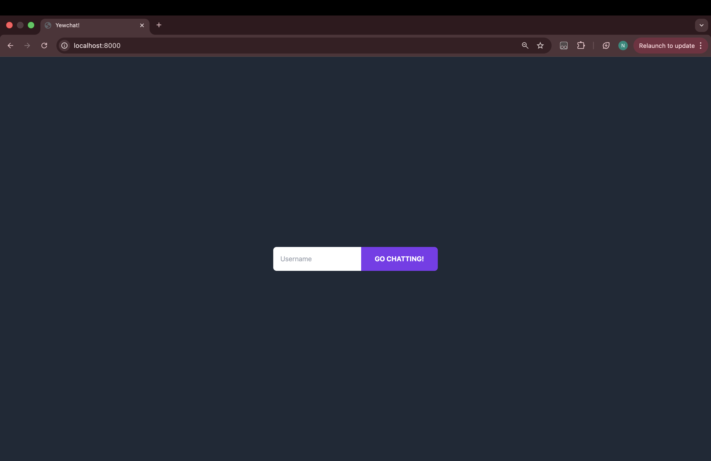
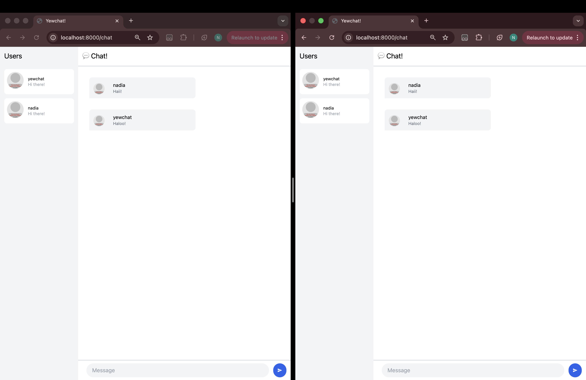
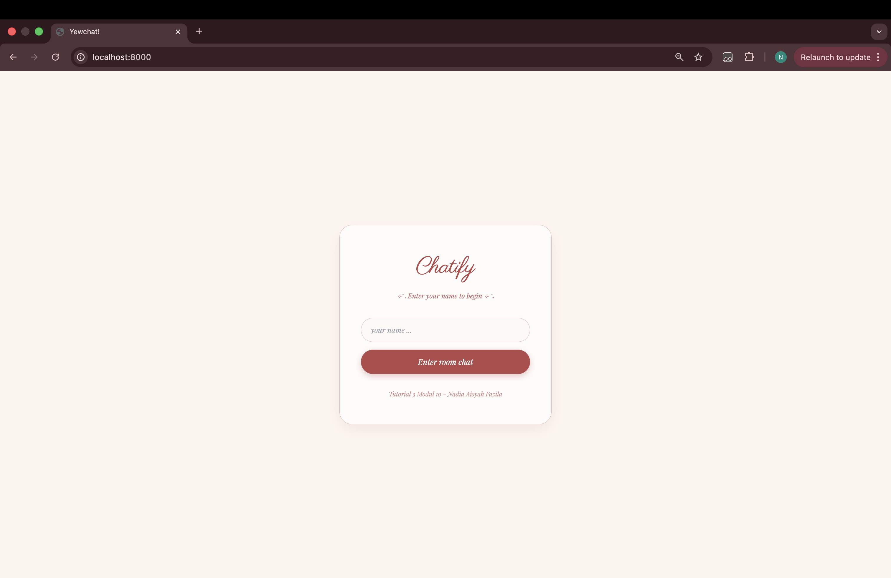
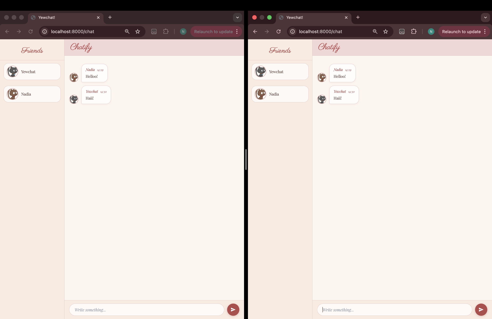

# Modul 10 - Tutorial 3 WebChat using yew

## Experiment 3.1: Original code
- **Screen capture**:
   - Login:
   
   - Chat:
   

## Experiment 3.2: Be Creative!
- **Screen capture**:
   - Login:
   
   - Chat:
   

- **Explanation**:
   - Saya design ulang tampilan YewChat dengan tema coquette. Perubahan yang saya lakukan diantaranya adalah mengubah keseluruhan color palette, font, serta tampilan halaman login dan chat yang disesuaikan dengan tema coquette.
   - Selain perubahan visual, saya juga menambahkan beberapa fitur tambahan. Setiap pesan sekarang menampilkan timestamp dalam format HH:MM yang digenerate di sisi client saat pesan diterima. Avatar pengguna juga digenerate menggunakan RoboHash dengan style kucing, sehingga setiap pengguna memiliki foto kucing yang unik.